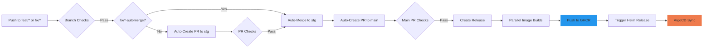

<!-- workflow test: improved documentation -->

# DevOps Demo Application

     

This repository contains a modern full-stack application with a FastAPI backend and React frontend, featuring a comprehensive CI/CD pipeline for AWS deployment. The application demonstrates best practices for DevOps workflows, including automated testing, continuous integration, and continuous deployment.

## Table of Contents

- [Architecture Overview](#-architecture-overview)
- [Development Environment Setup](#-development-environment-setup)
- [Makefile for Local Setup](#-makefile-for-local-setup)
- [Docker-based Development](#-docker-based-development)
- [Local Development](#-local-development)
- [Development Workflow](#-development-workflow)
- [CI/CD Pipeline](#-cicd-pipeline) (Automated release process)
- [Documentation](#-documentation)
- [Environment Configuration](#-environment-configuration)
- [Testing](#-testing)
- [Troubleshooting](#-troubleshooting)
- [Version Management](#-version-management)

## Development Environment Setup

After cloning the repository, run the following command to set up git hooks and merge drivers:

```bash
./scripts/setup-git-hooks.sh
```

This ensures that version files are merged correctly during git operations and prevents merge conflicts.

## Architecture Overview

```mermaid
graph TD
    A[Frontend - React/TypeScript] --> G[Traefik Reverse Proxy]
    G --> B[Backend - FastAPI]
    B --> C[(PostgreSQL Database)]
    D[CI/CD - GitHub Actions] --> E[GitHub Container Registry]

```mermaid
graph TD
    A[Frontend - React/TypeScript] --> G[Traefik Reverse Proxy]
    G --> B[Backend - FastAPI]
    B --> C[(PostgreSQL Database)]
    D[CI/CD - GitHub Actions] --> E[GitHub Container Registry]
    E --> F[Deployment Environment]
```

- **Frontend**: React, TypeScript, TanStack Query, Chakra UI
- **Backend**: FastAPI, SQLModel, Pydantic
- **Database**: PostgreSQL
- **Infrastructure**: Docker, Traefik, GitHub Container Registry (GHCR)
- **CI/CD**: GitHub Actions
- **Build Tools**: pnpm, Biome, UV (Python package manager)

## Development Environment Setup

### Prerequisites

- [Docker](https://www.docker.com/) and Docker Compose
- [Python](https://www.python.org/) (3.11+)
- [UV](https://github.com/astral-sh/uv/) for Python package management
- [Git](https://git-scm.com/)
- [pnpm](https://pnpm.io/) for efficient package management and faster builds

### Initial Setup

1. **Clone the repository**

```bash
git clone https://github.com/yourusername/fastAPI-project-app.git
cd fastAPI-project-app
```

2. **Use the Makefile for setup**

```bash
# Setup the project (create .env, install dependencies)
make setup
```

Or manually:

```bash
# Generate a secure .env file from .env.example
make env
# Or manually: cp .env.example .env
# Edit .env with your preferred settings
```

3. **Install git hooks with pre-commit**

```bash
pip install pre-commit
pre-commit install --hook-type pre-commit --hook-type commit-msg --hook-type pre-push
```

This will set up git hooks to automatically format code, run linting checks, and ensure code quality on commit.

## Makefile - The Central Interface for All Project Tasks

**The Makefile is the primary and recommended way to interact with this project throughout its entire lifecycle.** From initial setup and development to testing, deployment, and maintenance, all operations should be performed using the Makefile commands for consistency and efficiency.

All team members should use these commands rather than running individual tools directly to ensure everyone follows the same workflows and processes:

```bash
# Show available commands
make help

# Setup the project (create .env, install dependencies)
make setup

# Start Docker containers with pnpm
make up

# Initialize the database (create tables and first superuser)
make init-db

# Stop Docker containers
make down

# Restart Docker containers
make restart

# Run all tests
make test

# Create a new feature branch
make feat name=branch-name

# Create a new fix branch
make fix name=branch-name

# Create a new fix branch with automerge
make fix-automerge name=branch-name
```

## Database Initialization

The application automatically initializes the database when the backend container starts, creating all necessary tables and the first superuser account. This process is handled by the prestart script that runs before the FastAPI application starts.

If you need to manually initialize or reset the database, you can use:

```bash
# Initialize the database (create tables and first superuser)
make init-db
```

### Default Login Credentials

After initialization, you can log in with:

- **Email**: admin@example.com
- **Password**: The value of `FIRST_SUPERUSER_PASSWORD` in your `.env` file

## Fast Build System (pnpm + Traefik + UV)

This project uses a modern, high-performance build system:

- **pnpm**: For efficient package management with disk space optimization and faster builds
- **Traefik**: For efficient reverse proxy and routing
- **UV**: For optimized Python package management with dependency groups

All build operations are handled through Docker and the Makefile for consistency.

## Docker-based Development

The easiest way to get started is using our optimized Docker Compose setup, which configures all services including the frontend, backend, and database.

### Starting the Environment

```bash
# Using Makefile (recommended)
make up

# Or directly with Docker Compose
docker compose up -d
```

### Accessing Services

- **Frontend**: http://dashboard.localhost
- **Backend API**: http://api.localhost
- **API Documentation**: http://api.localhost/docs
- **API ReDoc**: http://api.localhost/redoc
- **API OpenAPI Schema**: http://api.localhost/openapi.json
- **Traefik Dashboard**: http://localhost:8080

### Default Login Credentials

After initialization, you can log in with:

- **Email**: admin@example.com
- **Password**: The value of `FIRST_SUPERUSER_PASSWORD` in your `.env` file

### Viewing Logs

```bash
# All services
docker compose logs -f

# Specific service
docker compose logs -f backend
```

### Rebuilding Services

```bash
# After code changes
docker compose up -d --build

# Restart all services
make restart
```

## Development Workflow

**All development must be done using the Makefile commands** for consistency across environments. The Makefile abstracts away the complexity of individual tools and provides a standardized interface for all development tasks, ensuring that everyone follows the same processes regardless of their local setup.

### Branching Strategy

This project follows a structured branching strategy to ensure code quality and streamline the development process:

1. **Main Branch (`main`)**
   - Production-ready code only
   - Protected from direct pushes
   - Changes only accepted through PRs from the `stg` branch
   - Triggers production builds and deployments

2. **Staging Branch (`stg`)**
   - Integration branch for features and fixes
   - Protected from direct pushes
   - Changes only accepted through PRs from feature/fix branches
   - Triggers staging deployments for testing

3. **Feature Branches (`feat/*`)**
   - Created for new features or enhancements
   - Branched from `stg`
   - First push automatically opens a PR to `stg`
   - Requires passing all tests and code reviews

4. **Fix Branches (`fix/*`)**
   - Created for bug fixes
   - Branched from `stg`
   - First push automatically opens a PR to `stg`
   - Can be marked for auto-merge by adding `automerge` suffix

5. **Workflow Automation**
   - When a PR to `stg` is merged, a new PR to `main` is automatically created
   - All branches are automatically deleted after successful merge

**Creating Branches:**

Always use the Makefile commands to create branches to ensure proper naming and setup:

```bash
# Create a feature branch
make branch-create type=feat name=your-feature-name

# Create a fix branch
make branch-create type=fix name=your-fix-name

# Create a fix branch with auto-merge enabled
make branch-create type=fix name=your-fix-name automerge=true
```

### Using pnpm and UV for Faster Builds

This project uses pnpm for frontend package management and UV for Python package management, significantly improving build times and reducing disk space usage:

```bash
# Using Makefile (recommended)
make up  # Starts all services with pnpm and UV

# Run pnpm commands through Makefile
make build  # Builds all workspaces (ensures containers are running)
make lint   # Runs linting across all workspaces

# Run backend-specific tasks through Makefile
make test-backend  # Run backend tests
make backend-lint  # Run backend linting

# Test login functionality
make check-login  # Verify API login works correctly
```

pnpm uses a content-addressable store for packages, making installations faster and more efficient. The node_modules are linked rather than copied, saving significant disk space. UV provides similar benefits for Python packages with its efficient dependency resolution and caching.

## Development Workflow

### Branch Strategy

1. **Feature Branches (`feat/* || fix/*`)**

   - Create for new features or bug fixes
   - Must pass pre-commit hooks before pushing
   - On push triggers:
     - Style checks (ruff, eslint, prettier)
     - Security checks (bandit, npm audit)
     - Linting & formatting
     - Unit tests
   - Requires PR review to merge to `stg`

2. **Staging Branch (`stg`)**

   - Integration branch for feature development
   - On push triggers:
     - Minimal test suite (unit, linting, security)
     - Automatic staging deployment
   - PR to `main` triggers:
     - Full test suite (integration, e2e, API)
     - Security scans
     - Performance tests
     - Documentation updates
     - Changelog generation

3. **Main Branch (`main`)**
   - Production-ready code
   - Protected branch requiring PR approval
   - On push/PR merge:
     - Complete test suite
     - Security scans
     - Dependency checks
   - Release tags trigger production deployment

### Creating a Feature

```bash
git checkout stg
git pull
git checkout -b feat/your-feature-name
# Make changes
git commit -m "feat: add amazing feature"
# Create PR to stg branch
```

### Testing Workflows Locally

You can test GitHub Actions workflows locally using the provided script:

```bash
# Interactive mode - guides you through workflow selection
node scripts/test-workflow-selector.js

# Test all workflows at once
node scripts/test-workflow-selector.js --all
```

In interactive mode, the script will guide you through selecting the workflow category, specific workflow file, and event type to test. Using the `--all` flag will test all workflows in all categories.

**Prerequisites:**
Before running workflow tests, you need to build the custom Docker image used for testing:

```bash
# Build the workflow test Docker image
docker build -t local/workflow-test:latest -f .github/utils/Dockerfile.workflow-test .
```

## CI/CD Pipeline

Our CI/CD pipeline uses GitHub Actions for automation and GitHub Container Registry for image management. The actual deployment is handled by a separate infrastructure repository:



### Optimized Build Pipeline

Our build pipeline features several optimizations for faster builds and deployments:

- **Parallel Image Building**: Frontend and backend images are built simultaneously using GitHub Actions matrix strategy
- **Component-Specific Caching**: Each component has dedicated cache scopes for faster builds
- **Semantic Versioning**: Robust version handling across environments
- **Automated Security Scanning**: All images are scanned for vulnerabilities before deployment
- **Image Verification**: All built images are verified before deployment to ensure they exist and have the required labels

### GitHub Container Registry (GHCR) Configuration

We use GitHub Container Registry to store and manage our Docker images:

- **Image Repository**: `ghcr.io/datascientest-fastapi-project-group-25/fastapi-project-app`
- **Tagging Strategy**:
  - Feature branches: `ghcr.io/datascientest-fastapi-project-group-25/fastapi-project-app:feat-branch-name`
  - Fix branches: `ghcr.io/datascientest-fastapi-project-group-25/fastapi-project-app:fix-branch-name`
  - Staging branch: `ghcr.io/datascientest-fastapi-project-group-25/fastapi-project-app:stg-{hash}`
  - Main branch: `ghcr.io/datascientest-fastapi-project-group-25/fastapi-project-app:latest`
  - Versioned releases: `ghcr.io/datascientest-fastapi-project-group-25/fastapi-project-app:v1.2.3`

#### Authentication

The GitHub Actions workflows automatically authenticate with GHCR using the built-in `GITHUB_TOKEN` secret. For local development, you can authenticate using:

```bash
# Login to GHCR
echo $GITHUB_TOKEN | docker login ghcr.io -u USERNAME --password-stdin

# Pull an image
docker pull ghcr.io/datascientest-fastapi-project-group-25/fastapi-project-app:latest
```

## Documentation

All project documentation is organized in the `docs/` directory for better maintainability:

- **[Development Guide](./docs/development/guide.md)** - Setting up and running the application locally
- **[Deployment Guide](./docs/deployment/guide.md)** - Deploying using GitHub Actions and GitHub Container Registry
- **[GitHub Actions Workflows](./docs/workflows/github-actions.md)** - Overview and best practices for CI/CD workflows
- **[Git Hooks](./docs/git-hooks.md)** - Documentation for the pre-commit git hooks setup
- **[Release Notes](./docs/release-notes.md)** - Comprehensive changelog of all project changes
- **[Version Management](./docs/VERSION-MANAGEMENT.md)** - How version management works and how to avoid merge conflicts

Component-specific documentation can be found in the respective directories:

- **[Backend Documentation](./backend/README.md)**
- **[Frontend Documentation](./frontend/README.md)**

For a complete overview of all documentation, see the [Documentation Index](./docs/README.md).

## Environment Configuration

The application uses environment variables for configuration. A sample `.env.example` file is provided as a template.

### Important Environment Variables

| Variable               | Purpose                         | Example                |
| ---------------------- | ------------------------------- | ---------------------- |
| `DOMAIN`               | Base domain for the application | `localhost`            |
| `SECRET_KEY`           | Used for JWT token generation   | `your-secret-key`      |
| `BACKEND_CORS_ORIGINS` | Configures CORS for the API     | `["http://localhost"]` |
| `POSTGRES_USER`        | Database username               | `postgres`             |
| `POSTGRES_PASSWORD`    | Database password               | `postgres`             |
| `POSTGRES_DB`          | Database name                   | `app`                  |

### Subdomain-based Routing

For local development, the application uses subdomain-based routing:

- `api.localhost` - Backend API
- `dashboard.localhost` - Frontend dashboard
- `adminer.localhost` - Database administration

To enable this on your local machine, add these entries to your hosts file:

```
127.0.0.1 api.localhost
127.0.0.1 dashboard.localhost
127.0.0.1 adminer.localhost
```

## Testing

**All testing should be performed using the Makefile commands** to ensure consistent test environments and configurations. The Makefile provides a unified interface for running all types of tests, from unit tests to GitHub Actions workflow tests.

### Running Tests with Makefile (Recommended)

```bash
# Run all tests
make test

# Run backend tests only
make test-backend

# Run frontend tests only
make test-frontend

# Run end-to-end tests
make test-e2e

# Test GitHub Actions workflows locally
make act-test-main         # Test main-branch.yml workflow
make act-test-protection   # Test branch-protection.yml workflow
make act-test-all          # Test all workflows
make act-test-dry-run      # Dry run of workflows (no execution)
```

### Manual Testing (Not Recommended)

If you must run tests manually (not recommended):

```bash
# Backend Tests
cd backend
source .venv/bin/activate
pytest

# Frontend Tests
cd frontend
npm test

# End-to-End Tests
cd frontend
npm run test:e2e
```

## Troubleshooting

### Common Issues

1. **Docker Compose Network Issues**

   - Restart Docker: `docker compose down && docker compose up -d`

2. **Database Connection Failures**

   - Check database credentials in `.env`
   - Ensure PostgreSQL service is running: `docker compose ps`

3. **Frontend API Connection Issues**

   - Verify CORS settings in `.env`
   - Check API URL configuration in frontend

4. **Login Issues**

   - If you can't log in, ensure the database is properly initialized: `make init-db`
   - Default login credentials are:
     - Email: admin@example.com
     - Password: Check your `.env` file for FIRST_SUPERUSER_PASSWORD
   - If login still fails, check the backend logs: `docker compose logs backend`
   - For a complete database reset: `docker compose down -v && make up && make init-db`

5. **Security Best Practices**:
   - Never commit `.env` files to version control
   - Use strong, unique passwords for all credentials
   - Rotate secrets regularly in production environments
   - Use different credentials for development, staging, and production

### Subdomain-Based Routing

The application uses a subdomain-based routing approach for different services:

1. **Local Development**:

   - API: http://api.localhost
   - Frontend: http://dashboard.localhost
   - API Docs: http://api.localhost/docs
   - API ReDoc: http://api.localhost/redoc
   - Adminer: http://db.localhost

2. **Configuration**:

   - The routing is handled by Traefik reverse proxy
   - Local development uses Traefik with appropriate hosts file entries
   - CORS is configured in Traefik to allow cross-subdomain communication

3. **Startup Information**:

   When you run `docker compose up`, you'll see:

   - Application URLs for all services
   - Default login credentials
   - Database initialization status
   - Health status of all components

   If you want to run the application in detached mode, use `docker compose up -d`.

   - than you can see the startup information in the logs `docker compose logs app-status`

4. **Adding a Host Entry (Local Development)**:
   ```bash
   # Add to /etc/hosts
   127.0.0.1 api.localhost dashboard.localhost db.localhost
   ```

## Version Management

This repository uses semantic versioning (SemVer) for managing versions. The version is stored in two places:

1. **VERSION file**: Used for Docker image tagging and Helm chart versioning
2. **package.json**: Used for npm package versioning and semantic-release

The version is automatically bumped based on the type of changes being made:

- **Major version** (X.0.0): Breaking changes (branches with "breaking" or "!" in the name)
- **Minor version** (0.X.0): New features (branches starting with "feat/")
- **Patch version** (0.0.X): Bug fixes and other changes (branches starting with "fix/")

### Automatic Version Bumping

Version bumping happens automatically at two points in the workflow:

1. **When opening a PR to the `stg` branch**:
   - The VERSION file is bumped based on the branch name
   - package.json is synchronized with the VERSION file
   - The PR title is updated to include the new version

2. **When merging a PR to the `main` branch** (except for stg → main PRs):
   - package.json is bumped based on the branch name
   - VERSION file is synchronized with package.json
   - A GitHub Release is created with the new version

### Automatic Conflict Resolution

To avoid merge conflicts in the VERSION file, we've implemented a custom Git merge driver that automatically resolves conflicts by keeping the higher version number.

For more detailed information about version management, see the [Version Management Documentation](./docs/VERSION-MANAGEMENT.md).

## Contributing

1. Fork the repository
2. Create your feature branch (`git checkout -b feat/amazing-feature`)
3. Commit your changes (`git commit -m 'feat: add amazing feature'`)
4. Push to the branch (`git push origin feat/amazing-feature`)
5. Open a Pull Request to the `stg` branch

## Project Structure
# Trigger build Sat Apr 21 21:30:00 CEST 2024
# E2E Workflow Test - Tue Apr 22 09:56:59 CEST 2025
# E2E Workflow Test - Second attempt - Tue Apr 22 10:21:23 CEST 2025
