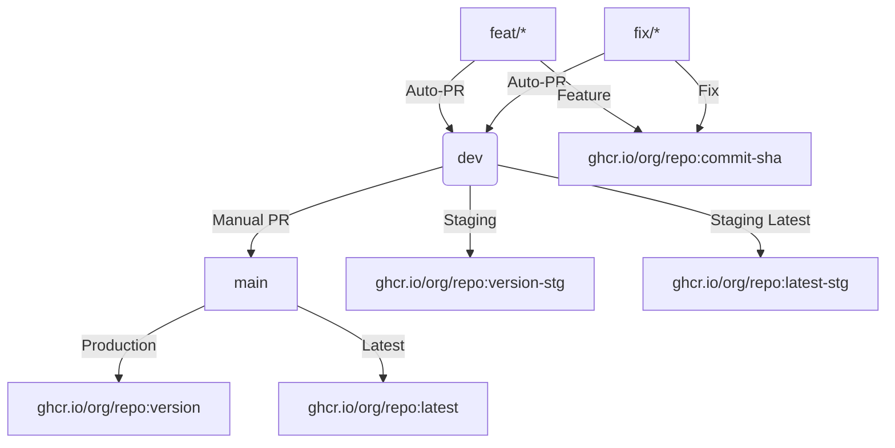

# Updated Branching Strategy

## Workflow Overview



1. **Main Branch** (`main`):
   - Production-ready code
   - Protected - no direct pushes
   - Only accepts PRs from `dev` branch
   - Merge triggers:
     - Production image build (ghcr.io/org/repo:version)
     - Latest tag update (ghcr.io/org/repo:latest)
     - Version tag (semver)

2. **Development Branch** (`dev`):
   - Staging environment
   - Accepts PRs from `feat/*` and `fix/*` branches
   - Merge triggers:
     - Staging image build (ghcr.io/org/repo:version-stg)
     - Auto-PR creation to `main`

3. **Feature Branches** (`feat/*`):
   - Created from `dev` branch
   - Push triggers:
     - Auto-PR to `dev`
     - CI tests
   - Naming: `feat/description` (e.g., `feat/user-auth`)

4. **Fix Branches** (`fix/*`):
   - Created from `dev` branch
   - Push triggers:
     - Auto-PR to `dev`
     - CI tests
   - Can use `-automerge` suffix for critical fixes
   - Naming: `fix/description` (e.g., `fix/login-bug`)

## Image Tagging Strategy

| Branch Type | Image Tag Format          | Registry Location          |
|-------------|---------------------------|----------------------------|
| feat/fix    | :commit-sha               | ghcr.io/org/repo           |
| dev         | :version-stg              | ghcr.io/org/repo           |
| main        | :version + :latest        | ghcr.io/org/repo           |

## Implementation Requirements

1. **GitHub Actions**:
   - Auto-PR creation on push
   - Image building/pushing
   - Version tagging
   - Status checks

2. **Branch Protection**:
   - `main`: Require PR, status checks, review
   - `dev`: Require PR, status checks
   - `feat/fix`: Require status checks

3. **Scripts**:
   - Updated `create-branch.js` to enforce naming
   - Pre-push hooks to prevent direct pushes to protected branches

4. **Version Management**:
   - Semantic versioning
   - Automated changelog generation
   - Release notes

## Setup Instructions

```bash
# Install dependencies
pnpm install

# Setup Git hooks
pre-commit install --hook-type pre-commit --hook-type commit-msg --hook-type pre-push
```

## Best Practices

1. Always create branches using the interactive tool:
   ```bash
   node scripts/create-branch.js
   ```

2. Keep branches focused and short-lived

3. Use meaningful, descriptive branch names

4. Regularly sync with upstream dev branch
