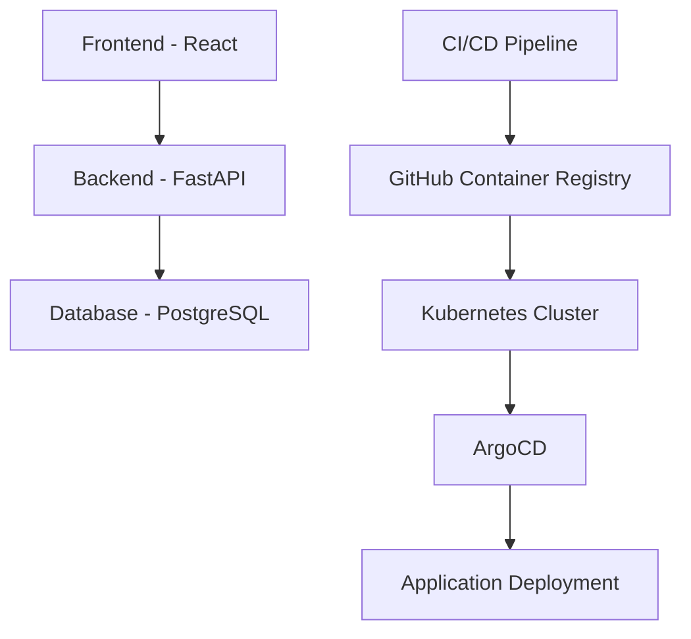

# FastAPI Project Documentation

Welcome to the FastAPI Project documentation. This GitBook-style documentation site contains the README files from all repositories in the project, automatically synchronized and updated.

## Project Repositories

| Repository | Description |
|------------|-------------|
| [App Repository](app/README.md) | The main application code with FastAPI backend and React frontend |
| [Release Repository](release/README.md) | Release management and deployment with Kubernetes and Argo CD |
| [Infrastructure Repository](infra/README.md) | Infrastructure as code with Terraform |

## System Architecture

## About This Documentation

This documentation is automatically synchronized from the README files in each repository. When a README is updated in any of the source repositories, it is automatically updated here and published as a GitBook-style site.

### Features

- **Centralized Documentation**: All project README files in one place
- **Automatic Synchronization**: Changes in source repositories are reflected here
- **GitBook-Style Navigation**: Easy-to-use navigation and search
- **Mermaid Diagrams**: Visual representation of architecture and workflows
- **Code Highlighting**: Syntax highlighting for code snippets
- **Mobile-Friendly**: Responsive design for all devices
